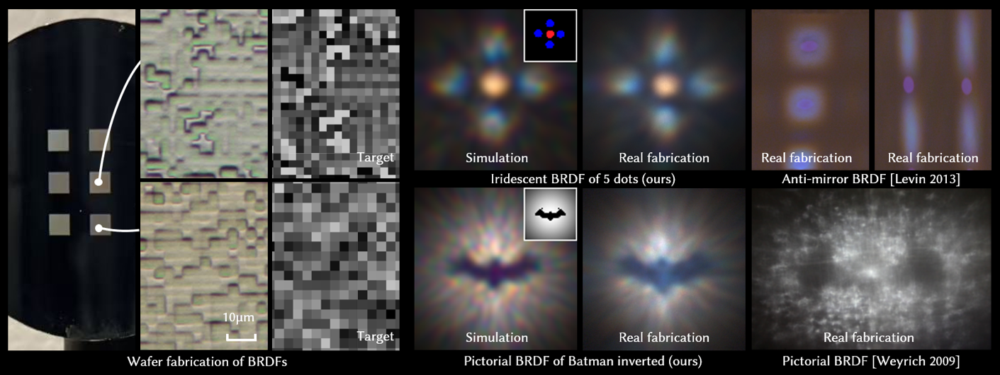

<p align="center">
  <h1 align="center">Designing and Fabricating Color BRDFs with Differentiable Wave Optics</h1>
  <p align="center">
    <a href="https://zyx45889.github.io/"><strong>Yixin Zeng</strong></a>
    ·
    <a href="https://sites.google.com/view/kiseokchoi"><strong>Kiseok Choi</strong></a>
    ·
    <a href="https://vccimaging.org/People/amatah/"><strong>Hadi Amata</strong></a>
    ·
    <a href="https://cocoakang.cn/"><strong>Kaizhang Kang</strong></a>
    ·
    <a href="https://vccimaging.org/People/heidriw/"><strong>Wolfgang Heidrich</strong></a>
    ·
    <a href="https://svbrdf.github.io/"><strong>Hongzhi Wu</strong></a>
    ·
    <a href="https://vclab.kaist.ac.kr/minhkim/"><strong>Min H. Kim</strong></a>
  </p>
  <h2 align="center">SIGGRAPH Asia 2025</h2>
  <div align="center">
    
  </div>


  <p align="center">
  <br>
    <a href="https://vclab.kaist.ac.kr/siggraphasia2025p1/"><strong>Project Page</strong></a>
    |
    <a href="https://github.com/KAIST-VCLAB/color-brdfs-with-wave-optics/assets/main.pdf"><strong>Paper</strong></a>
  </p>


</p>

*We present the first method for designing and fabricating color BRDFs using a fully differentiable wave optics framework.*

---

## Setup

### Environment

```bash
conda env create -f env.yml
conda activate rgs_cuda
pip install ./CUDA_modules/GaborRenderCUDA --no-build-isolation
```
The evironment is tested on cuda 12.8. Please make sure the pytorch cuda version matches the cuda version on your machine.

### Usage

We provide a few sample scripts from our paper. Change the 'date' item in the scripts and run:

#### Train

```bash
bash ./scripts/train_real.sh # real fabricated samples in Fig. 11
bash ./scripts/train_anti_mirror.sh # anti_mirror samples in Fig. 12
bash ./scripts/train_pic.sh # pictorial samples in Fig. 14
bash ./scripts/train_pic_inv.sh # inverse pictorial samples in Fig. 14
bash ./scripts/train_color.sh # color samples in Fig. 15
bash ./scripts/train_lightning.sh # colored pictorial samples in Fig. 16
bash ./scripts/train_circle.sh # iridescent samples in Fig. 17
```

The training converges after 30,000 to 100,000 iterations.

#### Test

To render the BRDF images, change the 'date' item in the scripts and run:

```bash
bash ./scripts/render_real.sh # real fabricated samples in Fig. 11
bash ./scripts/render_anti_mirror.sh # anti_mirror samples in Fig. 12
bash ./scripts/render_pic.sh # pictorial samples in Fig. 14
bash ./scripts/render_pic_inv.sh # inverse pictorial samples in Fig. 14
bash ./scripts/render_color.sh # color samples in Fig. 15
bash ./scripts/render_lightning.sh # colored pictorial samples in Fig. 16
bash ./scripts/render_circle.sh # iridescent samples in Fig. 17
```

To get the heightmaps sent to fabrication machine, comment out line 81 to line 146 in render_fab.py and run the previous rendering scripts with '--noise 0.0' and '--blur_sigma 0.0'.

#### Data

All trained model is listed in './output/'

## Citation

Cite as below if you find this repository is helpful to your project:

```
@inproceedings{bi2024rgs,
    title      = {Designing and Fabricating Color BRDFs with Differentiable Wave Optics},
    author     = {Yixin Zeng and Kiseok Choi and Hadi Amata and Kaizhang Kang and Wolfgang Heidrich and Hongzhi Wu and Min H. Kim},
    journal   = {ACM Transactions on Graphics (Proc. SIGGRAPH Asia 2025)},
    year      = {2025},
}
```

## Acknowledgments

We have intensively borrow codes from [gaussian splatting](https://github.com/graphdeco-inria/gaussian-splatting) and [gabor splatting](https://github.com/skywolf829/GaborSplatting). Many thanks to the authors for sharing their codes.
